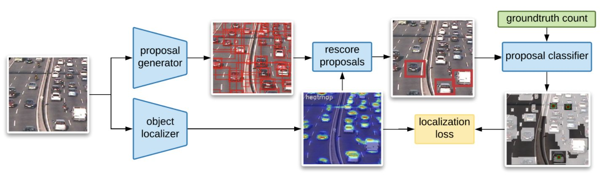

[](https://opensource.org/licenses/Apache-2.0)

## LOOC: Localize Overlapping Objects with Count Supervision (ICIP2020)
#### It uses an attention mechanism to learn from the most confident regions in order to infer predictions in the less confident ones.</h5>

[[Paper](https://arxiv.org/pdf/2007.01837.pdf)] 



### Install requirements
`pip install -r requirements.txt` 
This command installs the Haven library which helps in managing the experiments.


## Dataset

### Trancos

- `wget http://agamenon.tsc.uah.es/Personales/rlopez/data/trancos/TRANCOS_v3.tar.gz`


## Train & Validate LOOC on Trancos

```
python trainval.py -e looc_trancos -sb <savedir_base> -d <datadir> -r 1
```
where `<datadir>` is where the data is saved (example `.tmp/data`), and  `<savedir_base>` is where the results will be saved (example `.tmp/results`)


## Citation

@inproceedings{laradji2020looc,
  title={Looc: Localize Overlapping Objects with Count Supervision},
  author={Laradji, Issam H and Pardinas, Rafael and Rodriguez, Pau and Vazquez, David},
  booktitle={2020 IEEE International Conference on Image Processing (ICIP)},
  pages={2316--2320},
  year={2020},
  organization={IEEE}
}